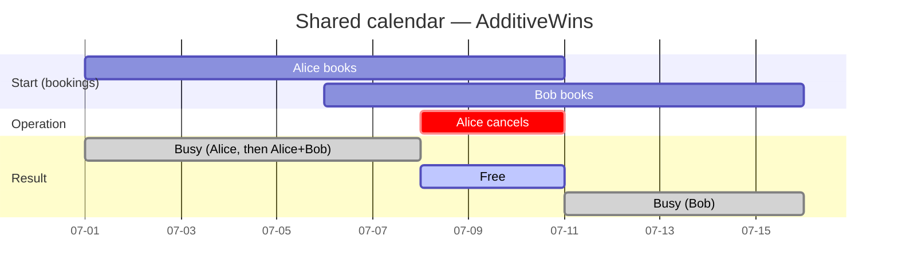

# eventfulranges

[](https://github.com/d-led/eventfulranges/actions/workflows/ci.yml)
[](https://codecov.io/gh/d-led/eventfulranges)
[](https://pkg.go.dev/github.com/d-led/eventfulranges)
[](LICENSE)

**A CRDT for real-valued ranges.** Any number of replicas add and remove ranges
on their own. Every replica that has seen the same operations ends up with the
same set — no coordinator, no consensus, any arrival order.

Four things people come here for:

| You want | How you get it |
| --- | --- |
| Several writers, no lock | `Add` / `Remove` locally, then exchange `Ops()` and call `ApplyAll` |
| Your choice of durability | `store.Log`: a JSON Lines file, memory, KurrentDB, or your own |
| Your choice of transport | channels, pub/sub, HTTP, an event log — convergence is transport-agnostic |
| Ranges or n-D boxes | `float64` intervals in 1-D; the `space` package for boxes in any dimension |

`go get github.com/d-led/eventfulranges`

**Read next:** [Quick start](#quick-start) · [Strategies](#strategies) ·
[Packages](#packages) · [Demos](#demos)

**Deep dives:** [CRDT map](docs/CRDT.md) · [Design](docs/DESIGN.md) ·
[n-D ranges](docs/N-DIM.md) · [Extensions](docs/EXTENSIONS.md) ·
[WebAssembly build](docs/WASM.md)

## Quick start

Step 1 — open a replica. The store decides where operations live:

```go
set, _ := eventfulranges.Open(ctx, "./example", strategy.LWW) // → ./example/ranges.stream.jsonl
```

Step 2 — add and remove ranges. `[1,10]` minus `[3,5]` leaves a hole:

```go
_, _ = set.Add(ctx, 1, 10)
_, _ = set.Remove(ctx, 3, 5)

for _, iv := range set.Ranges() {
    fmt.Println(iv) // [1,3)
                    // (5,10]
}
```

Step 3 — converge two replicas by exchanging operations, never state:

```go
_ = a.ApplyAll(ctx, b.Ops())
_ = b.ApplyAll(ctx, a.Ops())
// now a.Ranges() == b.Ranges()
```

That is the whole API surface for the common case. Everything below is a
choice: which strategy, which store, which transport.

## Example: a shared calendar

**A date is a day number, so a date range is a plain `float64` interval.** Two
people book overlapping vacations, one cancels part of hers, and the busy set is
the union of bookings minus cancellations:

```go
cal, _ := eventfulranges.OpenStore(ctx, memory.New(), strategy.AdditiveWins)
book, cancel := func(f, t string) { _, _ = cal.Add(ctx, days(f), days(t)) },
                func(f, t string) { _, _ = cal.Remove(ctx, days(f), days(t)) }

book("2026-07-01", "2026-07-10")   // Alice's vacation
book("2026-07-06", "2026-07-15")   // Bob's vacation (overlaps)
cancel("2026-07-08", "2026-07-10") // Alice cuts the trip short

cal.Contains(days("2026-07-01")) // true  — booked
cal.Contains(days("2026-07-08")) // false — cancelled
cal.Contains(days("2026-07-12")) // true  — Bob's still away
```



`AdditiveWins` is what makes that add up: the busy set is the union of all
bookings minus the union of all cancellations, so concurrent edits converge
whatever order they arrive in.

Full program: [`examples/calendar`](examples/calendar) — its own module, which
imports `v0.0.1` from the module proxy with no `replace` directive.

## Storage & transport

A replica is a `store.Log` plus a strategy. Three backends ship in the repo,
and you can plug in your own:

```go
set, _ := eventfulranges.Open(ctx, "./example", strategy.LWW)         // JSON Lines stream (default)
set, _ := eventfulranges.OpenStore(ctx, memory.New(), strategy.LWW)   // in memory
set, _ := eventfulranges.OpenStore(ctx, myBackend, strategy.LWW)      // your own store.Log
```

`Open` keeps the append-only event stream as JSON Lines
(`./example/ranges.stream.jsonl`). Snapshots are embedded as records in that
same stream rather than a sidecar file, which is what lets `Compact` rewrite
the stream in place without losing history. The stream is the source of truth;
a snapshot record only fast-forwards a restart.

Transport is yours to choose, too: convergence is just shipping `Ops()` and
calling `ApplyAll`. See [Demos](#demos) for channels, a pub/sub bus, and HTTP,
and [KurrentDB](#kurrentdb) for the event-database backend.

## Strategies

| Strategy       | Semantics                                          |
| -------------- | -------------------------------------------------- |
| `LWW`          | Highest `(timestamp, id)` wins at each point       |
| `FWW`          | Lowest `(timestamp, id)` wins at each point        |
| `AdditiveWins` | Union of all additions minus union of all removals |
| `GrowOnly`     | Union of all additions, removals ignored           |

## Packages

| Package                       | Purpose                                              |
| ----------------------------- | ---------------------------------------------------- |
| `interval`                    | 1-D open/closed intervals with canonical set algebra |
| `op`                          | The append-only operation (`add` / `remove`)         |
| `clock`                       | Hybrid logical clock and Lamport clock               |
| `strategy`                    | Conflict resolution: materializes ops to a set       |
| `engine`                      | Concurrency-safe log + view, snapshotting            |
| `store`                       | The `EventStore` interface (append/read/snapshot)    |
| `store/memory`, `store/jsonl` | In-memory and file backends                          |
| `space`                       | n-dimensional generalization (half-open boxes)       |
| `rtree`                       | Ephemeral bulk-loaded R-tree over `space.Box`        |
| `meta`                        | CRDT join for JSON-object metadata                   |

The n-dimensional stack mirrors the 1-D one package for package (`space/op`,
`space/strategy`, `space/store`, `space/engine`); see [docs/N-DIM.md](docs/N-DIM.md).

The public facade is the root package `eventfulranges`.

## Coordinates

Range endpoints are `float64`. Integer literals convert exactly while they fit
a float64's 53-bit mantissa (`|n| <= 2^53`); fractional values are stored and
compared verbatim, so no rounding error accumulates. There is no
arbitrary-precision (`math/big`) coordinate type: endpoints beyond `2^53` round
to the nearest representable value. `int64` is used only for bookkeeping —
operation timestamps and log-version counters — never as a coordinate.

## Demos

- [hello](#hello) — simplest use, no concurrency
- [local](#local) — goroutine replicas converge over channels
- [pubsub](#pubsub) — replicas converge over an in-process pub/sub bus
- [network](#network) — two HTTP peers converge
- [web](#web) — interactive 3D visualizer, shared live over WebSockets
- [paint](#paint) — infinite shared whiteboard over n-D boxes
- [kurrent](#kurrentdb) — the same operations, stored in KurrentDB
- [automerge and go-automerge](#automerge-and-go-automerge) — the same convergence under a different CRDT

### hello

```shell
go run ./demo/hello
```

`demo/hello` opens an in-memory set and prints what a single add/remove leaves
behind — the smallest possible program.

### local

```shell
go run ./demo/local
```

`demo/local` opens three in-memory replicas, lets each mutate its own copy from
a goroutine, then floods every replica's `Ops()` to every other replica until
they agree. The transport is Go channels; there is no network.

### pubsub

```shell
go run ./demo/pubsub
```

`demo/pubsub` is the same idea through a bus: each replica subscribes to a
topic on a `github.com/cskr/pubsub/v2` bus, mutates locally, and publishes its
operations. Every replica applies every broadcast it receives, so they converge
without talking to each other directly.

### network

```shell
go run ./demo/network
```

`demo/network` runs two replicas, each behind its own HTTP server. There is no
CRDT-specific protocol — a peer exports its log as `GET /ops` (JSON) and folds
someone else's log in with `POST /ops`. Each peer mutates its own copy, then
the two exchange logs and converge; ports come from `-ports 18080,18081`.

### web

```shell
go run ./demo/web
```

`demo/web` serves an n-dimensional range-set visualizer (1–4 dimensions, with a
rotatable translucent-box 3D view and copy/pasteable CSV). Everyone connected
to the same instance shares one view: each `add`/`remove` is folded with
additive-wins semantics and broadcast over a WebSocket, so concurrent edits
converge regardless of order. Open `http://localhost:8080/ui/`.

A hub also answers read-only region queries: a client sends
`{"kind":"search","min":[…],"max":[…]}` and gets back the boxes overlapping
that region. The index behind it is an ephemeral R-tree (`rtree`), dropped on
every edit and rebuilt lazily on the next query, so a query costs
`O(log n + k)` instead of a full scan. The tree holds no state of its own — two
hubs that converged on the same boxes answer identically.

One command starts it, and the other scripts cover the rest:

```bash
./scripts/demo-web.sh     # start the web visualizer (open the printed URL)
./scripts/build-web.sh    # (re)build the embedded UI (npm install + esbuild)
./scripts/itest-web.sh    # smoke test: unit tests + server serves the UI
./scripts/e2e-web.sh      # Playwright end-to-end tests
```

#### Running purely in the browser (WebAssembly)

**Live demo:** <https://d-led.github.io/eventfulranges/> (built and deployed
automatically by `.github/workflows/pages.yml` on every push to `main`).

The same visualizer also runs with **no Go server at all**: the session hub is
compiled to WebAssembly (`GOOS=js GOARCH=wasm`) and executes inside the page,
so the UI works from any static host. The page cannot tell the difference —
both builds speak the same JSON envelopes and reuse the same rendering code.
The seam is two switches in the code:

- **A session-engine interface** (`demo/web/ui-src/server-engine.js` vs
  `local-engine.js`): the WebSocket transport, or a direct call into the
  in-page Go engine (`demo/web/wasm.go`). Pick one with `?engine=local`, or by
  opening the local build, whose page preselects it.
- **A log repository** (`demo/web/persist.go` vs the browser's `localStorage`
  reserve): the server appends each operation to a JSONL file; the in-page
  engine is replayed from the browser's local copy on reload, exactly as a
  reconnecting socket would be healed.

```bash
./scripts/build-local.sh  # build demo/web/dist-local: UI + engine.wasm + wasm runtime
./scripts/serve-local.sh  # build and serve it statically (any static host works)
./scripts/e2e-local.sh    # Playwright tests against the in-page wasm engine
```

Each demo has a smoke test; run them with `go test ./demo/...`.


### paint

```shell
go run ./demo/paint
```

`demo/paint` is an infinite, shared pixel whiteboard built on the library's
n-dimensional range CRDT. Each stroke is one half-open `add`/`remove` box, so
a filled rectangle of cells is a single operation. Browsers receive the
operation log and materialize the view themselves — pure event sourcing — and
concurrent strokes converge regardless of arrival order. The share link is the
session URL, and the raw operation log is one click away as JSONL. Open
`http://localhost:8081/ui/`.

```bash
./scripts/demo-paint.sh     # start the whiteboard (open the printed URL)
./scripts/build-paint.sh    # (re)build the embedded UI (npm install + esbuild)
./scripts/itest-paint.sh    # smoke test: Go tests + server serves the UI
./scripts/e2e-paint.sh      # vitest unit tests + Playwright end-to-end tests
```

#### Admin area

The server exposes an admin area (`/admin/`, see `demo/paint/ui-src/admin.html`)
for inspecting instance storage and deleting inactive sessions. In the deployed
build the area is gated by the `ADMIN_EMAILS` reverse-proxy allow-list, so only
listed users reach it. In a development build (no `embed` build tag) the admin
gate opens to direct requests when `ADMIN_EMAILS` is unset, so the area is
usable locally without an oauth2-proxy; when `ADMIN_EMAILS` is set it is gated
exactly as in deployment. The dev-only gate is compiled out of embedded
artifacts, so it can never leak into a deployed binary.

#### Related — infinite canvases and zoom-first editors

- [tldraw](https://tldraw.dev) — open-source infinite canvas, real-time collaboration
- [Excalidraw](https://excalidraw.com) — infinite canvas, CRDT (Yjs) collaboration ([source](https://github.com/excalidraw/excalidraw))
- [Miro](https://miro.com) — infinite canvas, real-time collaboration
- [FigJam](https://www.figma.com/figjam/) — infinite canvas, real-time collaboration
- [InfiniPaint](https://infinipaint.com) — collaborative canvas with no zoom limit
- [Endless Paper](https://www.endlesspaper.app) — single-user infinite canvas
- [Prezi](https://prezi.com) — the zoomable-canvas presentation paradigm

### automerge and go-automerge

`demo/automerge` and `demo/go-automerge` run the same convergence story as the
other demos — two replicas edit a shared document concurrently, sync, and end
up identical — but the CRDT underneath is Automerge, not this library's range
CRDT. They exist to show the contrast: a JSON document with built-in conflict
resolution, versus a range set where the conflict policy is a choice you make
(`LWW`, `FWW`, `AdditiveWins`, `GrowOnly`).

```bash
./scripts/demo-automerge.sh      # tests + run, via automerge-go (needs cgo)
./scripts/demo-go-automerge.sh   # tests + run, via the pure-Go port (no cgo)
```

Neither demo touches the library; they are side-by-side comparisons, and the
Automerge dependencies live only in `demo/go.mod`.

## Quality

`scripts/quality-gate.sh` is the single gate: format, lint, tests, property,
fuzz, mutation, both UI builds, the WebAssembly build, and every Playwright
suite. On CI it runs as a manual `workflow_dispatch` job (the `quality-gate`
job, 45-minute timeout); every push and PR runs the fast path instead —
`golangci-lint` on both modules plus `scripts/test.sh` — and the Kurrent
integration test has a job of its own.

What the gate checks:

- `gofumpt` formatting
- `go vet`, `staticcheck`, `golangci-lint`, `gocyclo` (complexity ≤15),
  `revive`, `gosec`, `govulncheck`, `jscpd` (duplication ≤0.5%)
- unit tests with the race detector, at **100% statement coverage** of every
  library package (the gate prints the total; a shortfall is not yet a hard
  failure)
- property-based tests (`pgregory.net/rapid`) checked against a **biogo
  interval-tree oracle**, plus Jepsen-style concurrent scenarios
- fuzz smoke tests (Go native fuzzing)
- mutation testing (`gremlins`, ≥80% efficacy and ≥80% mutant coverage)

Run it locally:

```bash
./scripts/test.sh        # fast: unit tests + coverage report
./scripts/quality-gate.sh # full: format, lint, tests, property, fuzz, mutation, e2e
./scripts/lint.sh --install # install any missing static-analysis tools
./scripts/update-dependencies.sh # bump every module to its latest deps
```

## KurrentDB

[KurrentDB](https://kurrent.io) (formerly EventStoreDB) is the event-database
backend, behind the `kurrent` build tag: the operation log is a KurrentDB
stream, with snapshots in the same store.

```bash
./scripts/kurrent-up.sh          # docker compose up -d (needs Docker)
./scripts/demo-kurrent.sh        # run the KurrentDB-backed demo
./scripts/itest-kurrent.sh       # integration tests (build tag kurrent)
./scripts/kurrent-down.sh
```

`demo/kurrent` stores the same add/remove pair in KurrentDB and prints the
result, so the only difference from `demo/hello` is which `store.Log` the
replica is opened with. To run it by hand:

```bash
cd demo/kurrent && go run -tags kurrent .
```

## Docs

| Document | Answers |
| --- | --- |
| [CRDT map](docs/CRDT.md) | which strategy, which dimension, and where each lives |
| [Design](docs/DESIGN.md) | the model, the packages, the reasoning |
| [n-D ranges](docs/N-DIM.md) | boxes, the n-D engine, paint layers |
| [Extensions](docs/EXTENSIONS.md) | canonicalizers, metadata, merge verification, region queries |
| [WebAssembly build](docs/WASM.md) | the browser-only build and its GitHub Pages deploy |

## License

[MPL-2.0](LICENSE)
