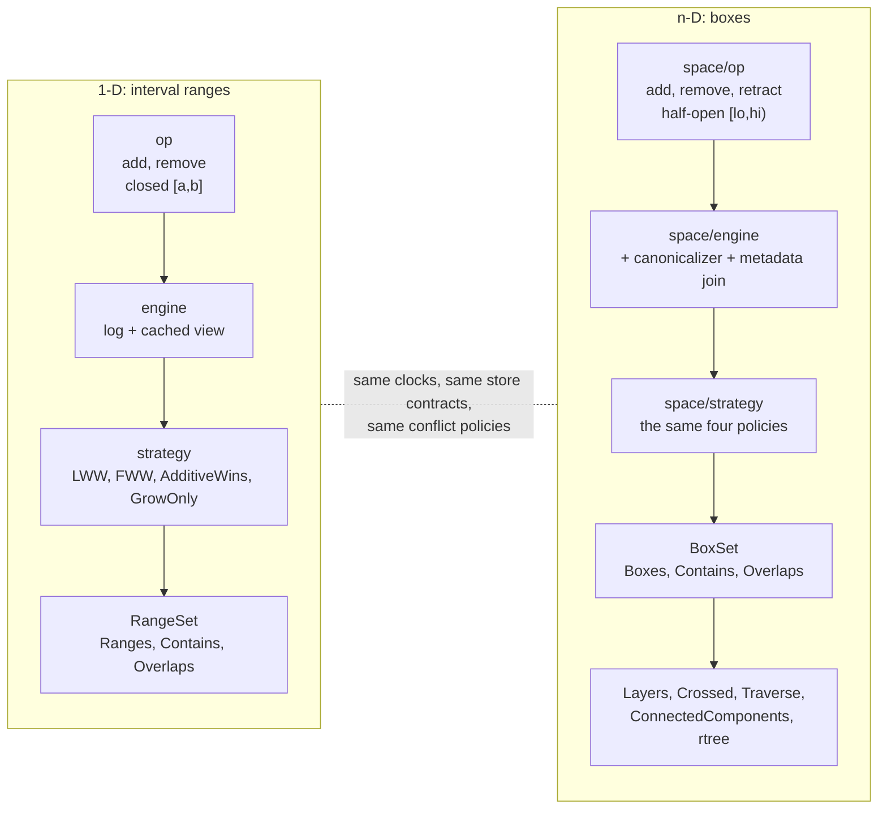
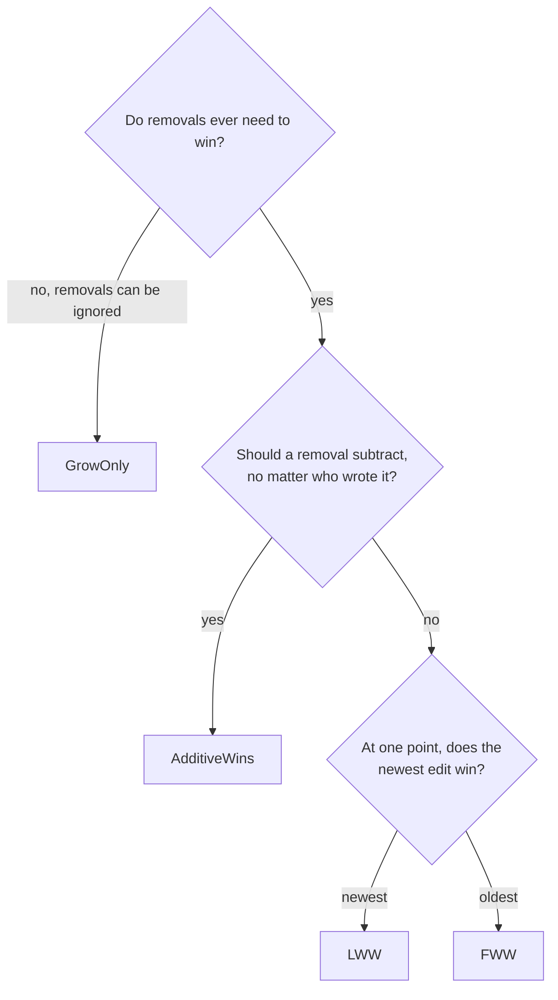

# The CRDT map

**How to read this page.** Every strategy and every dimension gets one table and
one link to the code. If you only read one section, read
[Pick a strategy](#pick-a-strategy).

**Where things live.** One-dimensional ranges live in the root package and its
subpackages. Boxes in any dimension live in `space` and its subpackages. The
same design runs in both.

## The whole library in one picture

**What to look for:** the right-hand column is the n-D stack. It repeats the
left one layer for layer, then adds three things 1-D does not have — metadata,
retraction, and query helpers.

## Pick a strategy

**What to look for:** three questions, and you are done. Every answer is one of
the four policies in the tables below.

Rules of thumb:

1. **Bookings, boards, painted regions** — `AdditiveWins`. Additions accumulate,
   cancellations subtract, order never matters.
2. **Last value of a field or a sensor reading** — `LWW`.
3. **First-write-wins ledgers** — `FWW`.
4. **Append-only where deletion is not a concept** — `GrowOnly`.

## The four strategies, 1-D

`(ts, id)` is a total order; the id breaks timestamp ties.

| Strategy | Semantics | Code |
| --- | --- | --- |
| `LWW` | Highest `(ts, id)` wins at each point | [`strategy.Materialize`](../strategy/strategy.go#L87) |
| `FWW` | Lowest `(ts, id)` wins at each point | same entry point |
| `AdditiveWins` | Union of adds minus union of removes | same entry point |
| `GrowOnly` | Union of adds; removes ignored | same entry point |

`LWW` and `FWW` project the history into winner-annotated segments
([`Segments`](../strategy/strategy.go#L101),
[`CombineSegments`](../strategy/strategy.go#L116)), then keep the add-decided
ones. `AdditiveWins` and `GrowOnly` keep running unions. The oracle the property
tests compare against is [docs/DESIGN.md](DESIGN.md#testing).

## The same four, n-D

Same names, same semantics, one package over: [`space/strategy`](../space/strategy/strategy.go#L96).

| Strategy | Semantics | Where it differs |
| --- | --- | --- |
| `LWW` | Highest `(ts, id)` wins per point | materialized from the **full** op list, never incrementally |
| `FWW` | Lowest `(ts, id)` wins per point | same |
| `AdditiveWins` | Union of adds minus union of removes | folds incrementally, like 1-D |
| `GrowOnly` | Union of adds | folds incrementally, like 1-D |

Two n-D differences worth knowing before you port code:

1. **The cover is not unique.** More than one set of boxes can cover the same
   points, so an incremental `LWW` fold could differ between replicas. n-D
   therefore materializes `LWW`/`FWW` from the whole op list.
2. **Paint order is a separate answer.** [`Layers`](../space/strategy/layers.go#L29)
   returns the boxes in bottom-to-top paint order, with fully covered boxes
   dropped. It is a rendering recipe, not the set cover — see
   [docs/N-DIM.md](N-DIM.md).

## Bounds: the one asymmetry to remember

| | 1-D | n-D |
| --- | --- | --- |
| `Add` / `Remove` build | **closed** `[a,b]` | **half-open** `[lo,hi)` |
| Explicit variant | [`AddWithBounds`](../op/op.go#L85) | [`space/op.AddBounds`](../space/op/op.go#L119) |
| Per-side type | `interval.Bound`, one per side | `space.Bound`, one per face |
| Why the default | closed is the `interval` convention | half-open keeps subtraction exact at shared edges |

`space.Box` is half-open by definition (`Min[i] <= p[i] < Max[i]`), and a nil
bounds slice means the half-open default. If you move calendar-style code from
1-D to n-D, add the bounds you meant — see
[docs/EXTENSIONS.md](EXTENSIONS.md) for the open/closed face extension.

## What sits on top of the strategies

| Feature | What it does | Where |
| --- | --- | --- |
| Canonicalizer | reshapes the materialized cover (merge adjacent boxes, compose pipelines) | [`space.Chain`](../space/canonical.go#L19), [`space.MergeAdjacent`](../space/canonical.go#L34), [docs/EXTENSIONS.md](EXTENSIONS.md) |
| Metadata join | merges the JSON metadata carried by boxes, under the union-based strategies | [`meta.Union`](../meta/meta.go#L23), [`WithMetaMerge`](../space/engine/engine.go#L54) |
| Retraction | cancels one operation by id, without touching the others | [`BoxSet.Retract`](../boxes.go#L125) |
| Region queries | which boxes a path crosses, and in what order | [`space.Crossed`](../space/path.go#L127), [`space.Traverse`](../space/path.go#L157) |
| Connected components | groups a cover into maximal touching regions | [`space.ConnectedComponents`](../space/components.go#L11) |
| Spatial index | ephemeral, bulk-loaded R-tree over a cover | [`rtree.Build`](../rtree/rtree.go#L50), [`Tree.Search`](../rtree/rtree.go#L100) |

Present in n-D only today: **retraction** and **per-box metadata**. The 1-D
stack has neither.

## The two facades

Start here when you write code, not at the subpackages.

| Want | 1-D | n-D |
| --- | --- | --- |
| Open a replica from a store | [`Open`](../eventfulranges.go#L41), [`OpenStore`](../eventfulranges.go#L52) | [`OpenBoxes`](../boxes.go#L51), [`OpenBoxStore`](../boxes.go#L60) |
| Mutate | `Add`, `Remove`, `AddWithBounds`, `RemoveWithBounds` | `Add`, `AddWithMeta`, `Remove`, `RemoveBounds`, `Retract` |
| Read | `Ranges`, `Contains`, `Overlaps` | `Boxes`, `Layers`, `Contains`, `Overlaps`, `Crossed`, `Traverse` |
| Sync | `Ops`, `ApplyAll` | `Ops`, `ApplyAll` |
| Maintain | `Snapshot`, `Compact` | `Snapshot`, `Compact` |

## Read next

| Question | Document |
| --- | --- |
| How does the algorithm work, and why these choices? | [docs/DESIGN.md](DESIGN.md) |
| What exactly is a box, and what does the n-D engine do differently? | [docs/N-DIM.md](N-DIM.md) |
| What is implemented, what is only proposed? | [docs/EXTENSIONS.md](EXTENSIONS.md) |
| How does this run in a browser with no server? | [docs/WASM.md](WASM.md) |
| What can I run right now? | [README § Demos](../README.md#demos) |
| A worked consumer, in its own module | [examples/calendar](../examples/calendar) |
