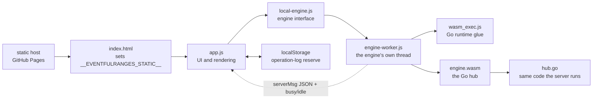
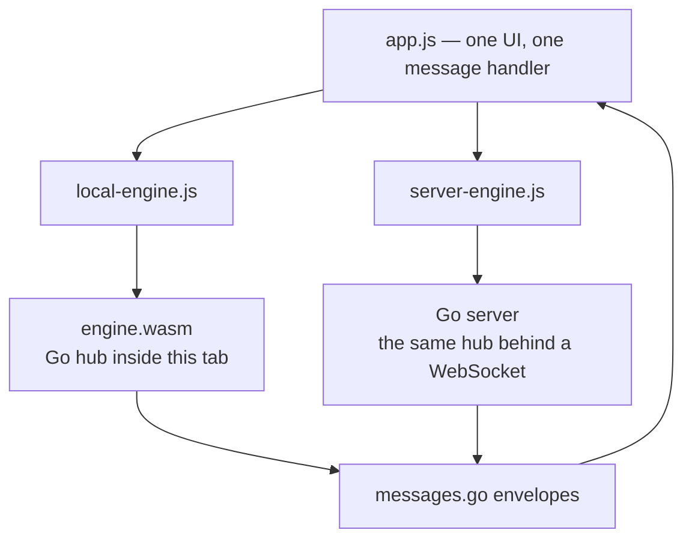
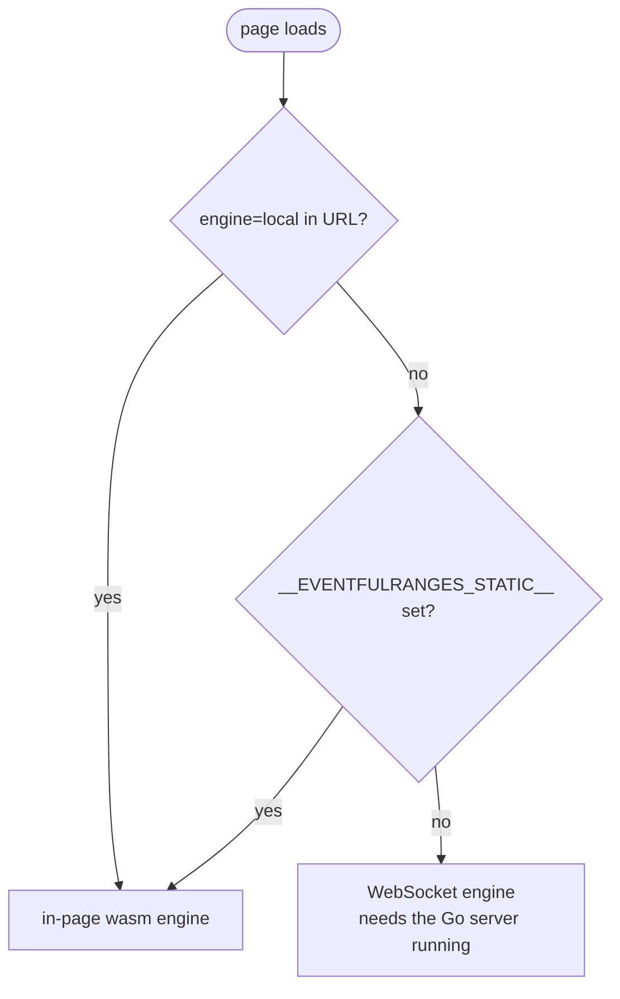
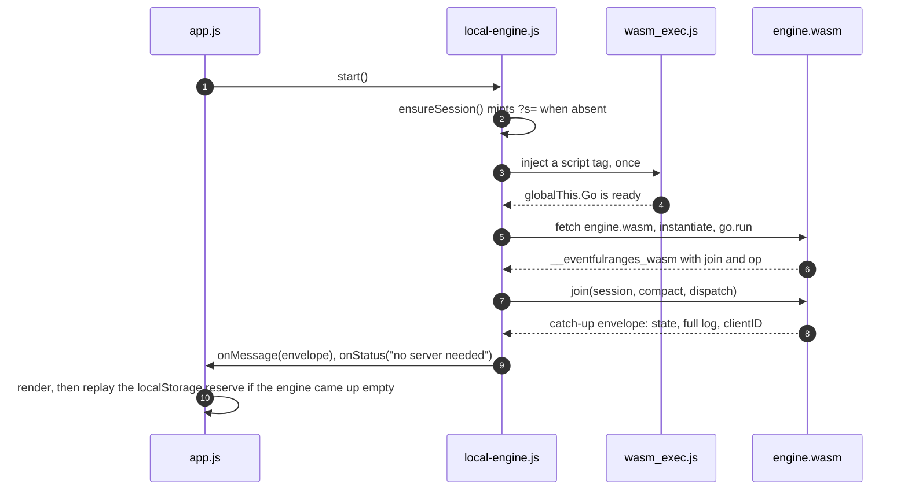
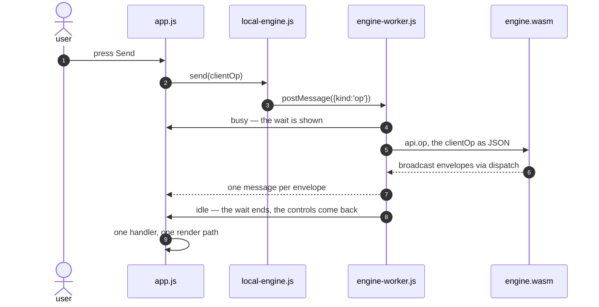
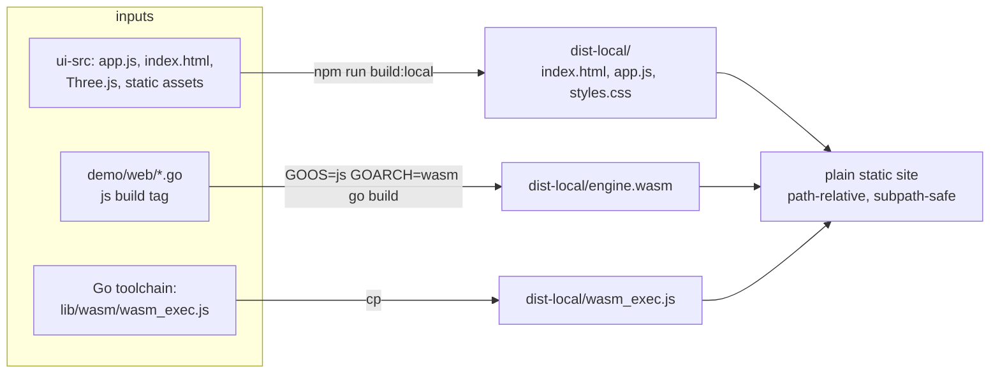
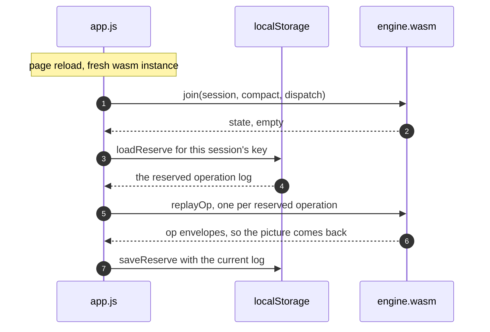
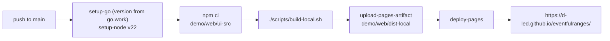

# The browser-only (WebAssembly) build

**What it is.** The web visualizer with the Go session hub compiled to
WebAssembly and running inside the page. No Go server, no process to host.

**Where it runs.** Any static host. The deployed one is
<https://d-led.github.io/eventfulranges/>, published by
[`.github/workflows/pages.yml`](../.github/workflows/pages.yml).

**Why it exists.** It proves the library has no server-side secrets: the same
Go engine that runs in a process runs in a browser tab, with the same JSON
on the wire.

**Scope.** This page covers the demo in `demo/web`, not the library API. For
the library itself, start at the [CRDT map](CRDT.md).

## The shape of it

**What to look for:** there is no server in the picture. Everything below loads
from static files and runs in the tab.



## Two engines, one protocol

| | server build | browser-only build |
| --- | --- | --- |
| Engine runs in | the Go server | this page (wasm) |
| UI talks over | a WebSocket | a direct call into wasm |
| Operations stored in | a JSONL file (`demo/web/persist.go`) | this browser's `localStorage` |
| Who shares one session | every browser on that server | this browser only |
| Built into | `demo/web/dist/` | `demo/web/dist-local/` |

Both speak the envelopes in `demo/web/messages.go`, so the UI cannot tell which
one it is talking to — same rendering code, same commands, same replies.



## Which engine the page picks

Three lines decide it, all in `demo/web/ui-src/app.js`:

1. `?engine=local` in the URL → the in-page wasm engine.
2. `window.__EVENTFULRANGES_STATIC__ === true` → the in-page engine. The local
   bundle's generated `index.html` sets this.
3. Otherwise → the WebSocket engine, which is the default when a Go server is
   serving the UI.



## The Go ↔ JavaScript bridge

`demo/web/wasm.go` (build tag `js`) publishes two functions on the page:

```js
globalThis.__eventfulranges_wasm = { join, op }
```

- `join(sessionID, compact, dispatch)` → returns one catch-up envelope as JSON:
  the full operation log, the materialized state, this tab's client id and
  presence. It is exactly what a late joiner receives from the server.
- `op(jsonClientOp)` → folds one `add` / `remove` / `dims` / `search` command.
  Nothing is returned; the resulting broadcast envelopes go to the `dispatch`
  callback registered by `join`.

One envelope path, both directions:

1. The page sends a `clientOp` — `api.op(...)` in wasm mode, a socket frame in
   server mode.
2. The engine folds it and emits a `serverMsg` — through `dispatch` in wasm
   mode, over the socket in server mode.
3. The page handles that message with the same code either way — that is the
   whole point of the seam.

The wasm instance keeps one hub per page, because browser-only mode has a single
viewer per tab. A new session or a reload replaces the hub with a fresh one.

## Why the engine has its own thread

A fold is unbounded work: every operation re-materializes the whole log, and
under `partition-merge` that means re-partitioning and re-merging the entire
cover. On a 3D session with a few dozen operations that is fast, but it grows
steeply with the operation count, and Go's wasm runtime cannot yield in the
middle of one — no goroutine preemption, no `await`. On the main thread it would
freeze the canvas, the buttons and any progress feedback along with it.

So `engine-worker.js` owns the wasm instance, and the page talks to it with the
same JSON envelopes it would send down a socket. Two things fall out of that:

- **The page keeps painting.** The canvas orbits and the buttons repaint while
the engine works.
- **The wait can be shown and acted on.** The worker reports `busy` before each
fold and `idle` after it, which the page turns into the "merging the operation
log…" overlay and into disabling the controls that would queue more work. A
spinner drawn on a blocked thread cannot appear until the block is over; this
one can.

The cost of the thread boundary is that `send` is no longer synchronous: the
envelopes come back as messages. The UI never depended on that — it renders
what the engine broadcasts, in both engines.

## How a page comes to life

**What to look for:** JavaScript asks the Go module for exactly one catch-up
envelope, then listens. The Go side never reaches back except through the
`dispatch` callback that `join` was handed.



## Sending an operation

**What to look for:** the two builds differ in one hop only. Everything from the
hub outward — folding, the reply envelope, the rendering — is the same code.



## What the build produces

`scripts/build-local.sh` does three things:

1. `npm run build:local` (→ `ui-src/build-local.mjs`) bundles the UI, Three.js
   and the static assets into `demo/web/dist-local/`.
2. `GOOS=js GOARCH=wasm go build -trimpath -ldflags="-s -w" -o
   dist-local/engine.wasm .` compiles the hub.
3. Copies `wasm_exec.js` from `$(go env GOROOT)/lib/wasm/` next to it.



`dist-local/` ends up as a plain static site:

| File | Role |
| --- | --- |
| `index.html` | the page, with `__EVENTFULRANGES_STATIC__` set |
| `app.js`, `styles.css` | the UI bundle |
| `engine.wasm` | the Go hub |
| `wasm_exec.js` | the Go wasm runtime, from the toolchain |

Everything is path-relative and resolved against the module's own URL, so the
folder works from a subpath such as `/eventfulranges/` — no rewriting needed.

The runtime glue comes from the installed Go toolchain. After a Go upgrade,
rebuild the bundle; a mismatched `wasm_exec.js` fails at load time.

## Persistence without a server

There is nowhere on a static host to append to, so the page carries its own log:

1. `app.js` keeps a reserve copy of the session's operation log in
   `localStorage`, under `eventfulranges:web:<session>`.
2. On load, the page asks the engine to join; the engine starts empty.
3. The page replays the reserve back in, and the view is restored.



The same rule heals a restarted Go server, which is why one mechanism covers
both builds. If `localStorage` is unavailable (private mode) or full, the log
still lives in memory for as long as the page does.

## Deploying to GitHub Pages

`.github/workflows/pages.yml` runs on every push to `main`:

1. `actions/setup-go` (version from `go.work`) and `actions/setup-node` (v22).
2. `npm ci` in `demo/web/ui-src`.
3. `./scripts/build-local.sh`.
4. `actions/upload-pages-artifact` with `demo/web/dist-local`.
5. `actions/deploy-pages` publishes it.

The job is `concurrency: group: pages, cancel-in-progress: true`, so a rapid
push sequence deploys the last commit only.



## Known boundaries

- **A share link is a seed, not a channel.** In this build each browser keeps
  its own log, so two devices opening the same link do *not* see each other's
  edits. Cross-device sharing needs the server build.
- **Presence says 1.** There is no socket and no roster: the engine reports
  `1 here`, because the tab is the only viewer there is.
- **No server-side expiry.** The server build retires idle sessions; the static
  build has no clock to retire them, so a link's data lives until
  `localStorage` is cleared.
- **First load pays for the runtime.** The page fetches `wasm_exec.js` and
  `engine.wasm` before the first render of the engine's state.

## Testing

```bash
./scripts/e2e-local.sh   # build, then the Playwright suite for the wasm engine
```

`e2e-local.sh` builds, installs Chromium, and runs
`npm run test:local` (`playwright.local.config.mjs`) against the static build —
the same browser-visible behaviour the server suite checks, with the engine
inside the page.

## File map

| Path | Role |
| --- | --- |
| `demo/web/wasm.go` | the `js`-tagged entry point: `join`, `op`, dispatch |
| `demo/web/ui-src/engine-worker.js` | the engine's thread: loads the wasm module, reports busy and idle around each fold |
| `demo/web/ui-src/local-engine.js` | spawns the worker, exposes the engine's `start`/`send`/`reconnect` interface |
| `demo/web/ui-src/server-engine.js` | the WebSocket transport behind the same interface |
| `demo/web/ui-src/build-local.mjs` | the static bundle, and the `index.html` that preselects the wasm engine |
| `demo/web/messages.go` | the envelopes both engines speak |
| `demo/web/ui-src/serve-local.mjs` | the dev loop: rebuild on change, serve without caching |
| `scripts/build-local.sh` | the whole build |
| `scripts/serve-local.sh` | build, then serve on `:8082` with `python3 -m http.server` |
| `scripts/watch-local.sh` | build, then rebuild on every change and serve on `:8082` |

## Read next

- [CRDT map](CRDT.md) — the strategies and dimensions this UI is driving
- [n-D ranges](N-DIM.md) — the boxes the visualizer draws
- [Extensions](EXTENSIONS.md) — where region queries and the R-tree sit
- [README § Demos](../README.md#demos) — every runnable demo, including this one
